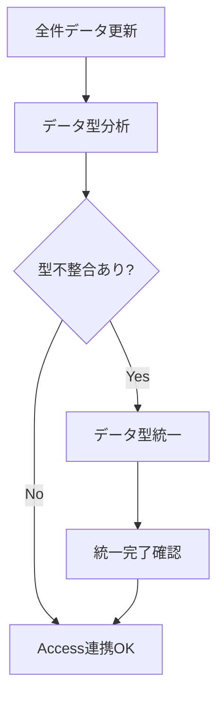

# データ型整合性管理機能 v2.1

## 概要

SQLiteとAccessデータベース間でのデータ型不整合を解決するための機能です。特に品目コード系フィールドの型統一により、安全なデータ連携を実現します。

## 背景・課題

### SQLiteとAccessの型システムの違い

| 項目 | SQLite | Access |
|------|--------|--------|
| 型システム | 動的型付け | 静的型付け |
| 型制約 | 柔軟（同一カラムに異なる型可） | 厳密（定義型のみ） |
| 品目コード | INTEGER/TEXT混在 | 統一必須 |
| ゼロパディング | 自動消失の可能性 | 保持必須 |

### 実際の問題例

```sql
-- 問題のあるケース
zm29.品目: INTEGER = 1234567      -- ゼロが消失
zp02.品目: TEXT = "0001234567"    -- ゼロパディング保持

-- JOIN時のエラー
SELECT * FROM zm29 
JOIN zp02 ON zm29.品目 = zp02.品目  -- 型不一致エラー
```

## 実装機能

### 1. データ型分析機能

#### 機能概要
- 全テーブルの品目コード系フィールドを自動検出
- データ型の不整合を分析・報告
- サンプルデータによる実態確認

#### 検出対象フィールド
- フィールド名に含まれるキーワード: `品目`, `code`, `コード`
- 対象テーブル: 全ユーザーテーブル

#### 分析結果例
```
--- 品目コード系フィールドの型分析 ---
zm29.品目: INTEGER - サンプル: ['1234567', '2345678', '3456789']
zp02.品目: TEXT - サンプル: ['0001234567', '0002345678', '0003456789']
zp138.品目コード: INTEGER - サンプル: ['1234567', '2345678', '3456789']

TEXT型: 1 フィールド
INTEGER型: 2 フィールド

⚠️ 以下のフィールドはINTEGER型です（Access連携時に注意）:
  - zm29.品目
  - zp138.品目コード
```

### 2. データ型統一機能

#### 機能概要
- 品目コード系フィールドを文字列型（TEXT）に統一
- 適切なゼロパディング（10桁）を自動適用
- Access連携に対応した安全な型変換

#### 変換処理フロー

1. **対象フィールド特定**
   ```python
   code_fields = [
       ('zm29', '品目'),
       ('zp02', '品目'), 
       ('zp138', '品目コード'),
       ('zs65', '品目コード'),
       ('MARA_DL', '品目'),
       ('view_pc_master', '品目'),
       ('parsed_pc_master', '品目')
   ]
   ```

2. **型変換処理**
   ```python
   # 数値を10桁ゼロパディング文字列に変換
   num_val = int(float(str(value)))
   formatted_value = f"{num_val:010d}"
   ```

3. **テーブル再構築**
   - 一時テーブル作成
   - データ変換・コピー
   - 元テーブル置換

#### 変換例

| 変換前 | 変換後 |
|--------|--------|
| `INTEGER: 1234567` | `TEXT: "0001234567"` |
| `INTEGER: 123` | `TEXT: "0000000123"` |
| `TEXT: "1234567"` | `TEXT: "0001234567"` |

## 使用方法

### 基本ワークフロー



### 操作手順

1. **データ型分析の実行**
   ```
   DB管理タブ → データ型分析ボタン → 分析結果確認
   ```

2. **データ型統一の実行**
   ```
   DB管理タブ → データ型統一ボタン → 確認ダイアログ → 実行
   ```

3. **結果確認**
   ```
   スキーマタブ → テーブル構造確認 → 型統一確認
   ```

## 技術仕様

### 対象データ型

| 変換前 | 変換後 | 備考 |
|--------|--------|------|
| INTEGER | TEXT | ゼロパディング適用 |
| INT | TEXT | ゼロパディング適用 |
| REAL | TEXT | 整数部のみ抽出 |
| TEXT | TEXT | 既にTEXTの場合は桁数調整のみ |

### ゼロパディング仕様

- **桁数**: 10桁固定
- **形式**: `0000000123` (先頭ゼロ埋め)
- **対象**: 品目コード系フィールドのみ

### エラーハンドリング

1. **テーブル不存在**: スキップして次のテーブルを処理
2. **フィールド不存在**: スキップして次のフィールドを処理
3. **データ変換エラー**: エラーログ出力後、元の値を文字列化
4. **SQL実行エラー**: ロールバックして元の状態を保持

## パフォーマンス

### 処理時間の目安

| テーブルサイズ | 処理時間 |
|---------------|----------|
| 1,000行 | 1-2秒 |
| 10,000行 | 5-10秒 |
| 100,000行 | 30-60秒 |
| 1,000,000行 | 5-10分 |

### メモリ使用量

- **一時テーブル**: 元テーブルと同等のメモリ使用
- **ピーク時**: 元テーブルの約2倍のメモリ使用
- **完了後**: 元のメモリ使用量に戻る

## 注意事項

### 1. バックアップの重要性
- 型変換は不可逆的な操作
- 実行前に必ずデータベースのバックアップを作成
- 重要なデータは別途保存を推奨

### 2. 処理時間
- 大きなテーブルでは処理に時間がかかる
- 処理中はデータベースがロックされる
- 他の操作は処理完了まで待機

### 3. Access連携
- 統一処理後はAccess側でのデータ型定義も確認
- JOINクエリの性能向上を確認
- インデックスの再作成を推奨

## トラブルシューティング

### よくある問題と解決方法

1. **「テーブルがロックされています」エラー**
   - 他のアプリケーションでデータベースを開いていないか確認
   - SQLite GUI Toolを再起動

2. **メモリ不足エラー**
   - 大きなテーブルは分割処理を検討
   - 不要なアプリケーションを終了してメモリを確保

3. **変換後のデータが期待と異なる**
   - 元データに文字列が混在していないか確認
   - サンプルデータで事前テストを実施

## 関連機能

### 1. データベース診断
- 型統一前後の状態比較
- パフォーマンス影響の確認

### 2. スキーマ表示
- 変換後のテーブル構造確認
- データ型の視覚的確認

### 3. クエリ実行
- 型統一後のJOINクエリテスト
- データ整合性の確認

## 今後の拡張予定

### 1. 自動化機能
- データ更新時の自動型統一
- スケジュール実行機能

### 2. カスタマイズ機能
- ゼロパディング桁数の設定
- 対象フィールドの個別指定

### 3. 検証機能
- 変換前後のデータ整合性チェック
- Access連携テスト機能